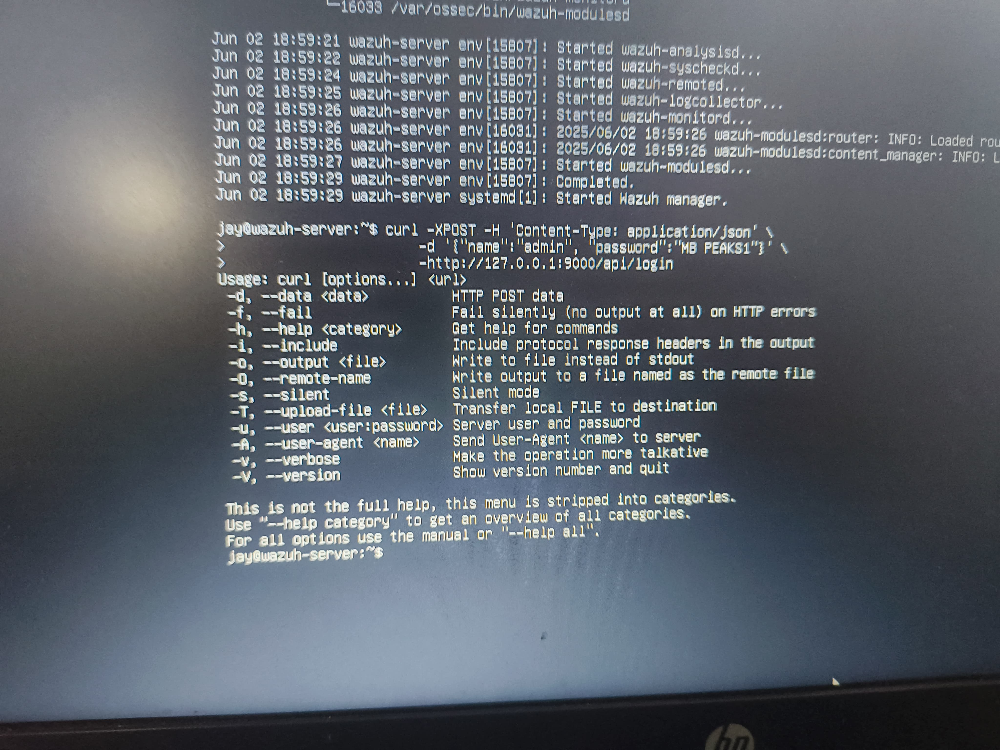
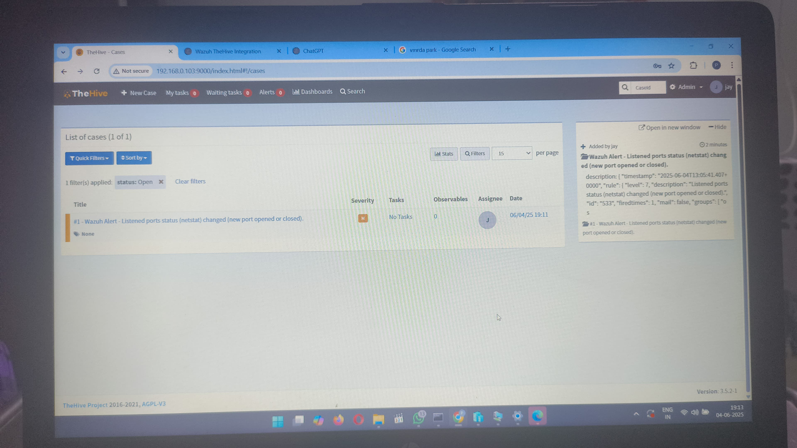
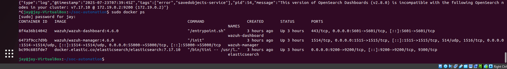

# ⚙️ SOC Automation with Wazuh, TheHive & Docker

A complete project to simulate SOC automation using **Wazuh**, **TheHive**, and **Docker Compose**, designed to streamline alert detection and case management.

---

## 📌 Project Overview

This project showcases a working integration of:

- **Wazuh**: For real-time security monitoring and threat detection  
- **TheHive**: For incident response and case management  
- **Docker Compose**: To containerize and orchestrate the setup efficiently

The goal is to automate the security alert flow — from Wazuh detecting an event to automatically forwarding it to TheHive as a case.

---

## 🧱 Architecture


---

## ⚙️ Components

| Component       | Purpose                               |
|----------------|----------------------------------------|
| **Wazuh**       | Monitors logs, triggers alerts         |
| **TheHive**     | Receives alerts, manages cases         |
| **Python Script** | Sends alerts to TheHive               |
| **Docker Compose** | Deploys containers easily           |

---

## 📂 Project Structure

```
SOC-Automation-Wazuh-TheHive/
├── alert_sample.json             # Sample Wazuh alert forwarded to TheHive
├── architecture.png              # SOC architecture diagram
├── docker-compose.yml            # Docker configuration for Wazuh stack
├── README.md                     # Professional project overview
├── scripts/
│   └── sample_alert_sender.py    # Python script to send alert to TheHive
└── screenshots/
    ├── 1-wazuh-to-thehive-alert.jpg
    ├── 2-wazuh-api-curl-login.jpg
    └── 3-wazuh-containers-running.png
```

---

## 📦 Sample Alert (`alert_sample.json`)

```json
{
  "timestamp": "2025-06-04T13:05:41.407+0000",
  "rule": {
    "level": 7,
    "description": "Listened ports status (netstat) changed (new port opened or closed)."
  },
  "title": "Wazuh Alert - Listened ports status changed",
  "tags": ["wazuh", "netstat", "automation"],
  "severity": "medium"
}
```

---

## 🐍 Python Script to Trigger Alert

```python
import requests
import json

THEHIVE_URL = 'http://192.168.0.103:9000/api/case'
API_KEY = 'Your_TheHive_API_Key'

headers = {
    'Content-Type': 'application/json',
    'Authorization': f'Bearer {API_KEY}'
}

alert_case = {
    "title": "Wazuh Alert - Netstat Status Changed",
    "description": "Alert from Wazuh: Listened ports status changed.",
    "severity": 2,
    "tags": ["wazuh", "automation"],
    "tlp": 2,
    "pap": 2
}

response = requests.post(THEHIVE_URL, headers=headers, data=json.dumps(alert_case))
print(response.status_code, response.text)
```

---

## 🐳 Docker Compose Services

```yaml
version: "3.8"

services:
  wazuh:
    image: wazuh/wazuh
    ports:
      - "1514:1514/udp"
      - "55000:55000"
    volumes:
      - wazuh-data:/var/ossec/data

  elasticsearch:
    image: docker.elastic.co/elasticsearch/elasticsearch:7.10.2
    environment:
      - discovery.type=single-node
    volumes:
      - esdata:/usr/share/elasticsearch/data

  kibana:
    image: docker.elastic.co/kibana/kibana:7.10.2
    ports:
      - "5601:5601"
    depends_on:
      - elasticsearch

volumes:
  wazuh-data:
  esdata:
```

---

## 📸 Screenshots

### 🔁 Alert Sent from Wazuh to TheHive  


### 🔐 Wazuh API Login via cURL  


### 🐳 Docker Containers Running  


---

## 🧠 Conclusion

This project simulates a real-world SOC workflow:

- Detect a security event in Wazuh  
- Automatically forward it to TheHive  
- Generate a case for investigation  
```
